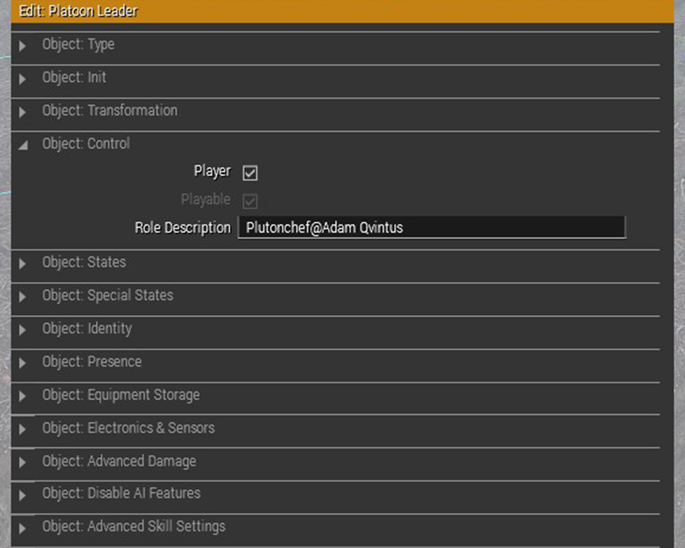
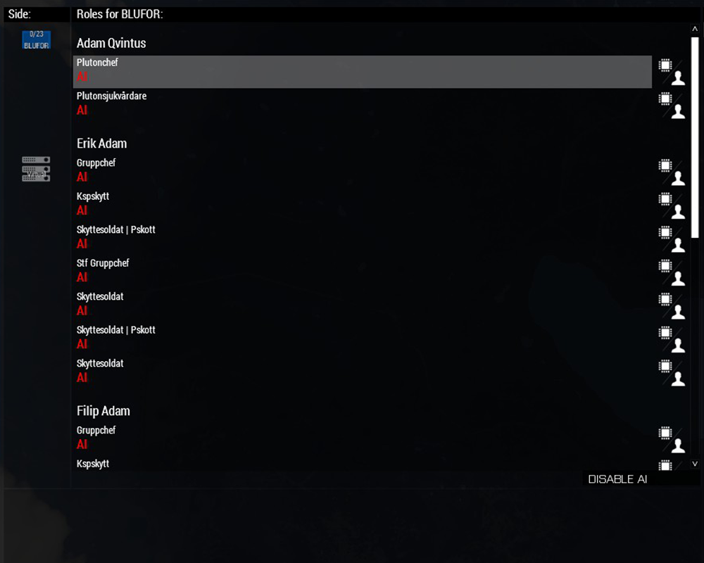

# Eden Editor

Eden Editor är den nya 3D editorn som ersatte den tidigare 2D editorn.

Mer tips och tricks finns att läsa på [Bohemias Wiki](https://community.bistudio.com/wiki/Eden_Editor)

## Compositions

### Färdiga

* [ZEC - Zeus and Eden Templates / Building Compositions](https://steamcommunity.com/sharedfiles/filedetails/?id=642912021)
* [ZECCUP - Zeus and Eden Templates for CUP Terrains](https://steamcommunity.com/sharedfiles/filedetails/?id=750186990)
* [ZEI - Zeus and Eden Interiors](https://steamcommunity.com/sharedfiles/filedetails/?id=1251859358)

## Gruppnamn i lobbyn

I CBA A3 finns en smidig funktion som låter uppdragsskapare sätta namn på sina grupper i lobbyn.
Fyll i rutan "Role Description" med gruppens namn på **samtliga** gruppmedlemmar.

Läs mer på [Name Groups in Lobby
](https://github.com/CBATeam/CBA_A3/wiki/Name-Groups-in-Lobby)