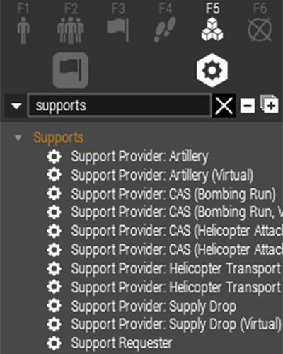
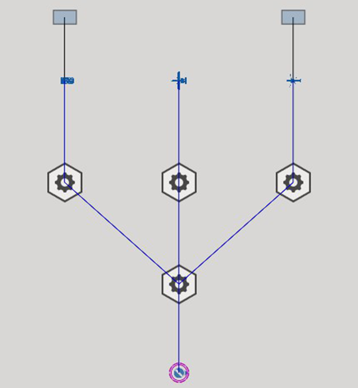
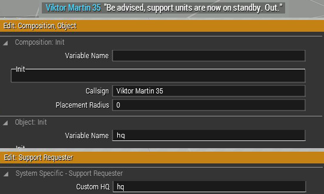
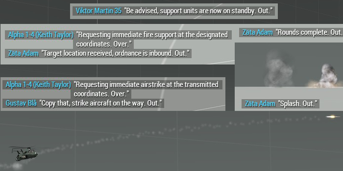
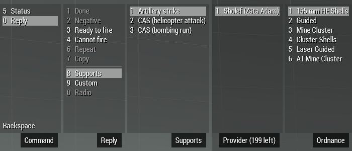
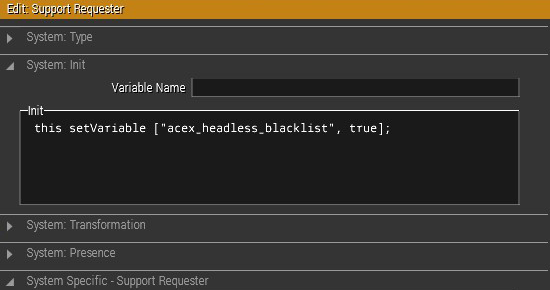

# Fire Support

## Vad

Fire Support &mdash; eldunderstöd på svenska &mdash; utgörs av till exempel artilleri, attack- och pansarvärnshelikoptrar eller attackflyg.

Samling av indirekt eld är ett snabbt sätt att uppnå lokal överlägsenhet och helikoptrar och flygplan kan bära betydligt tyngre beväpning, är mycket snabbare, och har längre räckvidd än de flesta markbaserade vapensystem som förekommer i Arma.

## Varför

* För att undvika att behöva avdela spelare till att sköta t.ex. artilleripjäser, och därmed döma dem till att sitta och vänta på att få en uppgift.
* För att ha eldunderstöd i ett uppdrag oavsett spelarantal.
* För att ha flera olika former av eldunderstöd tillgängliga i ett uppdrag.

Om ett givet förband inte själv har förmåga eller möjlighet att bekämpa eller nedkämpa ett mål kan det nyttja andra enheters förmågor till sin fördel:  
>En infanteripluton har upptäckt eller hamnat i strid med en motståndare de inte själva rår på &mdash; t.ex. ett stridsvagnsförband eller en numerärt överlägsen fiende &mdash; de kan då kalla in indirekt eld eller attackflyg för att lösa problemet.

## Hur

### Du behöver följande moddar

* *Du behöver inga moddar för att kunna använda understödsmodulerna.*
* Du kan självfallet inte använda andra fordon eller pjäser än de som ingår i Arma 3 utan moddar &mdash; till exempel Swedish Forces Pack, RHS, eller CUP.

### Instruktioner

Börja med att placera ut en **Support Requester**-modul, och en **Support Provider**-modul vardera av de typer du vill använda.  
Du hittar dem i EDEN under `System/Supports`.

Därefter placerar du ut enheterna som ska tillhandahålla understödet. T.ex. en artilleripjäs eller en attackhelikopter.  
Synca alla fordon och artilleripjäser med motsvarande Suport Provider-modul, och alla Support Provider-moduler med Support Requester-modulen.

Synca sedan Support Requester-modulen med den eller de spelbara enheter som ska kunna kalla in understödet. De kommer därigenom dela på samma understödspool med denna lösning.

I Support Requester-modulen anger du hur många gånger en viss understödstyp går att använda. Du kan till exempel ange:

* Hur många salvor artilleripjäserna kan skjuta
* Hur många gånger en attackhelikopter kan kallas in
* Hur många gånger attackflyg kan fälla bomber

Support Requester-modulen kan också ange vilken enhet som samordnar understödet.  
Det gör du genom att skriva in enhetens variabelnamn i fältet `Custom HQ`.  
Genom att ändra enhetens anropssignal i fältet `Callsign` kan du välja vilken anropssignal som ska visas i chatten &mdash; alla understödsenheters gruppnamn visas också som del av deras "radiotrafik".

## Användning

| Steg | Knapp  | Förklaring |
| - | - | - |
| 0 | Backspace | Använder du ACE behöver du öppna menyn innan du kan navigera i den |
| 1 | 0 | Välj "Reply" |
| 2 | 8 | Välj "Supports" |
| 3 | 1..5 | Sikta på den punkt du vill kalla in understöd mot och välj den understödsfunktion du vill använda |
| 4 | - | Välj den enhet som ska utföra uppgiften |
| 5 | - | Om applicerbart för understödstypen får du nu välja ammunition eller projektiltyp, välj den lämpligaste |

## Tänk på det här

Använder du huvudlösa klienter i uppdraget behöver du lägga till dina supportmoduler och supportenheter i ACEX svartlista. Lägg följande kodsnutt i deras *init*-fält:  
`this setVariable ["acex_headless_blacklist", true];`

Du bör **inte** möjliggöra för varenda skytteslusk att kalla på understöd, då kommer det användas upp väldigt fort med potentiellt katastrofala följder.

Bomber och indirekt eld kan skada egen trupp och utrustning om användaren är ouppmärksam på var han siktar.
Var medveten om att spelarna kommer att nyttja resurserna annorlunda än du planerat när du bygger uppdraget.
