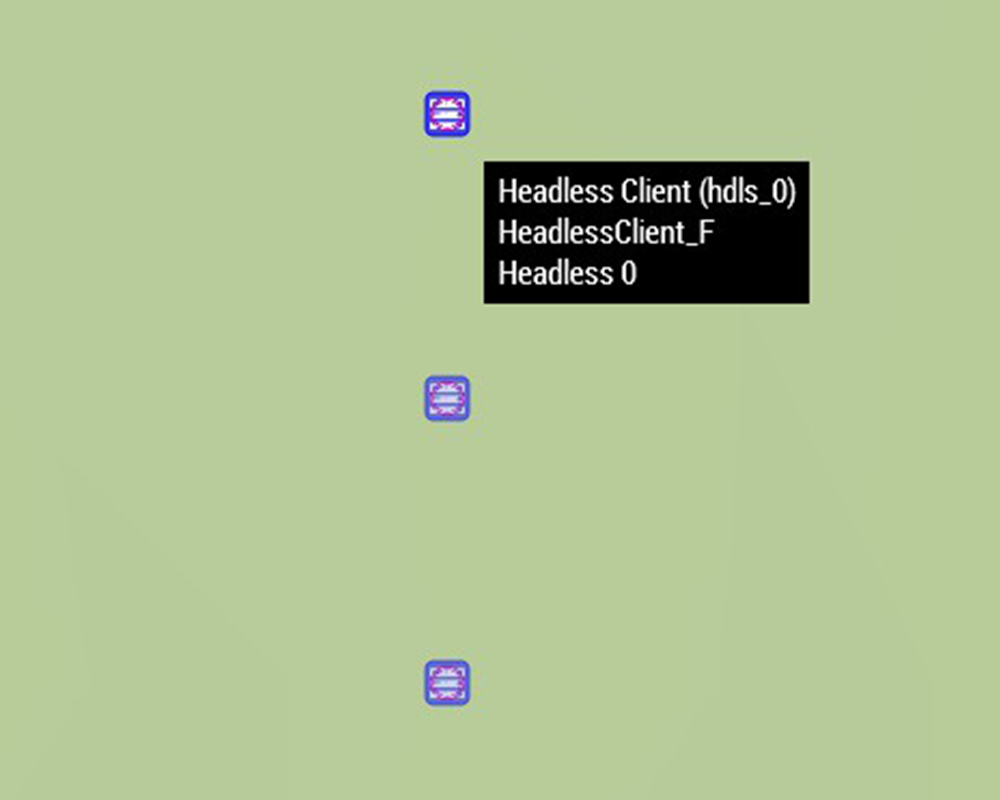
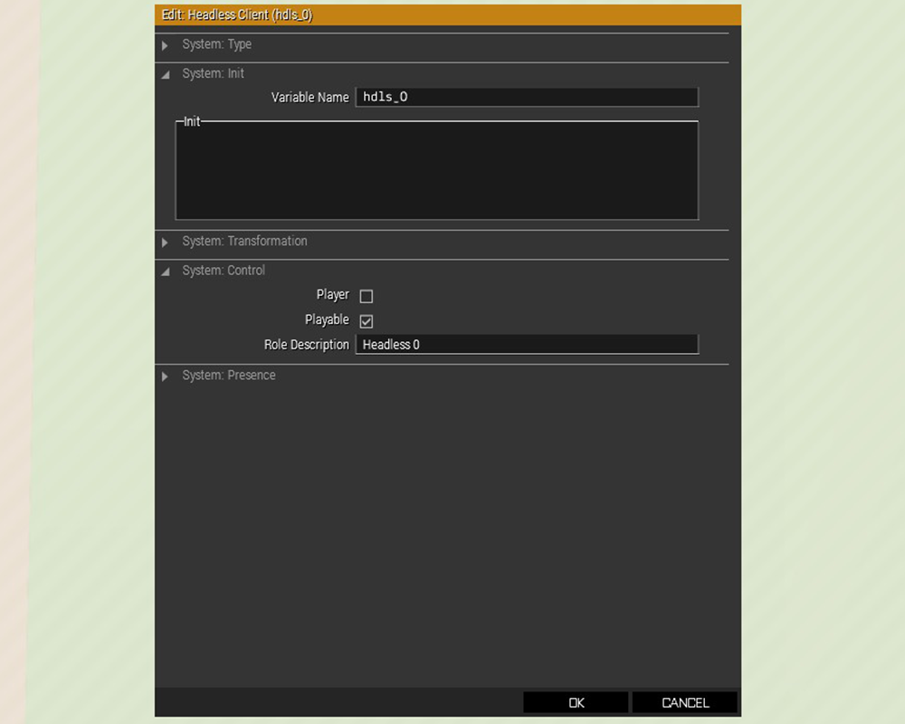
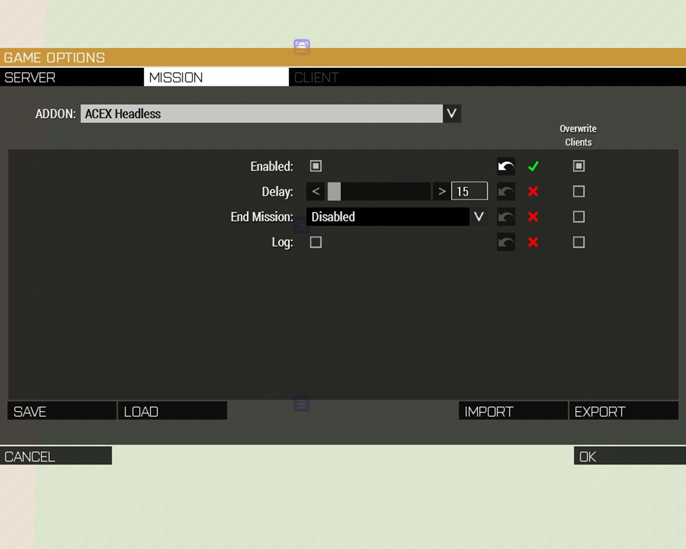
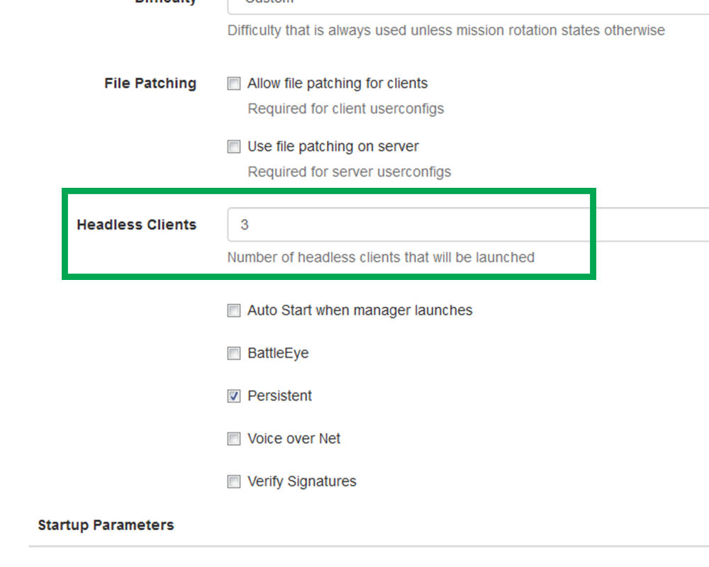

# Headless med ACEX

## Vad

Huvudlösa klienter - "headless clients" är processer som styr AI-enheter och körs separat från spelservern.

## Varför

Istället för att spelservern ska ta hand om både nätverkstrafik mellan alla anslutna klienter och samtidigt styra alla AI-enheter i uppdraget bör du använda huvudlösa klienter.
De avlastar spelservern, som istället kan lägga tid och kraft på att hantera nätverkstrafiken, och ger därigenom markant förbättrad prestanda.

## Hur

### Du behöver följande moddar

* [ACEX](https://steamcommunity.com/sharedfiles/filedetails/?id=708250744)
* [ACE3](https://steamcommunity.com/sharedfiles/filedetails/?id=463939057)
* [CBA A3](https://steamcommunity.com/workshop/filedetails/?id=450814997)

Först placerar du ut exakt 1 eller exakt 3 Headless client-moduler. Att ha jämnt antal kan ge upphov till problem med lastbalansering, fler än tre stöds inte av ACEX.  
Du hittar dem i EDEN under Game Logic/Virtual Entities.

Därefter konfigurerar du varje modul som på bilden nedan.  
De **MÅSTE** vara spelbara, du bör också ge dem variabelnamn och beskrivning för att kunna se att de ansluter korrekt i lobbyn.

I Anrops CBA settings som körs på servern är ACEX Headless påslaget, det behöver du alltså inte konfigurera själv, men se till att du inte skriver över CBA settings i uppdraget så att headless stängs av.  
De CBA settings som körs på Anrops server finns att tillgå som mod, den hittar du här: [Anrop CBA settings (Steam)](https://steamcommunity.com/sharedfiles/filedetails/?id=1591805823)  
Vill du pilla på det själv så ser det ut såhär i EDEN

Om du ska slå på huvudlösa klienter i en serverpreset ser det ut såhär i serveradmininterfacets settingsflik.  
Se också till att antal spelare är tänkt spelarantal + antal huvudlösa klienter, då en huvudlös klient tar upp en anslutningsplats till servern.

## Tänk på det här

Om du har enheter som är kritiska för en trigger eller något kodstycke bör du stoppa följande i enhetens init-fält.  
`this setVariable ["acex_headless_blacklist", true];`

**NOTERA att spelarkaraktärer EJ kan handskas av en headless-klient, spelarnas enheter körs på spelarnas egna datorer.**  
**Enheter som är editerbara av Zeus körs på dennes dator, vilket också är skäl till att det ibland går väldigt tungt för servern.**

När servern startats och du loggat in som admin i serverlobbyn bör du nu se 1 eller 3 huvudlösa klienter som anslutit och tagit de platser du skapat åt dem.  
De är osynliga för alla anslutna förutom den som loggat in som serveradmin, och räknas mot det anslutna antalet klienter i lobbyn.

Säkerställ även att dina triggers och din kod körs med rätt lokalitet. Om du har serverkod som kollar local, eller som kräver argument från local, så kan du få problem.  
Vill du interagera med enheten från servern bör du nyttja koden ovan.

Om du har waypoints som ska aktiveras av kod eller villkor placerar du en *trigger* i vilken du stoppar in koden. Sedan länkar du triggern som "Set Waypoint Activation" till den waypoint som ska aktiveras av koden.
