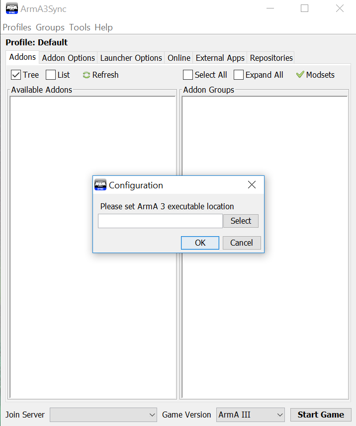
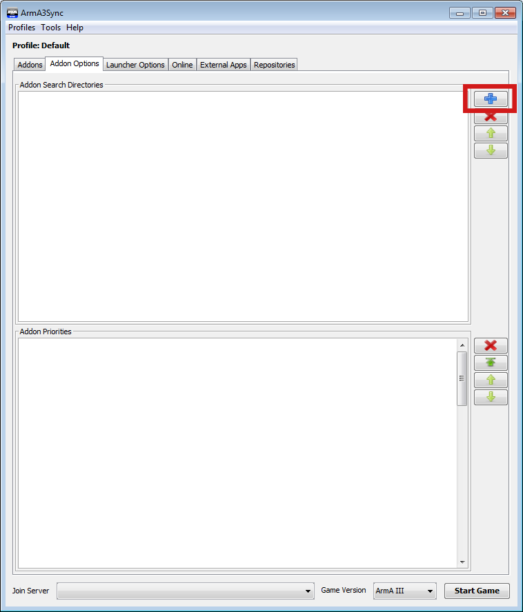
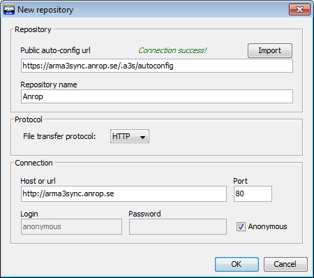
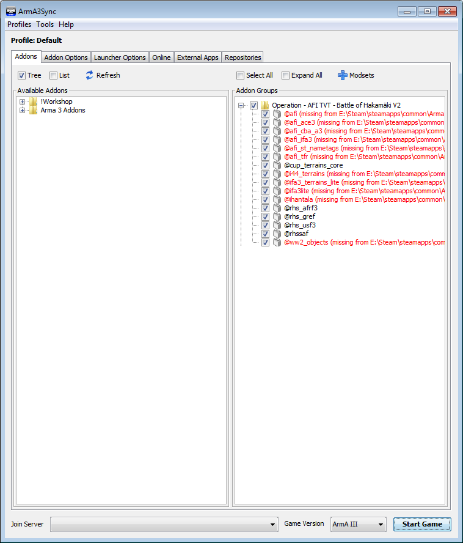
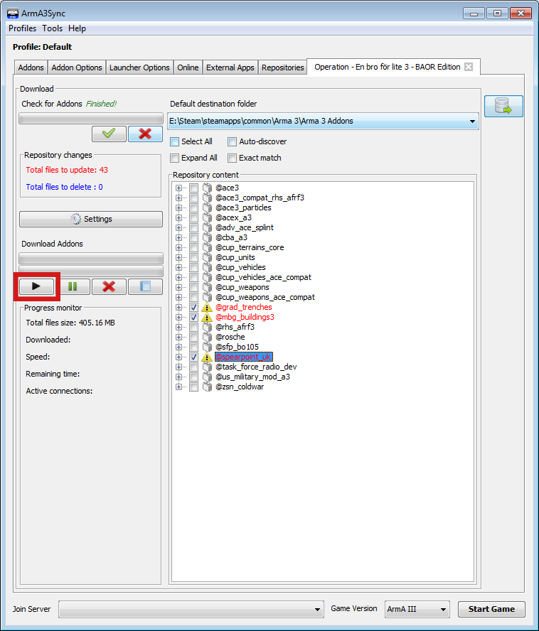

# Arma3Sync

## Vad

Arma3Sync är en kraftfull launcher för Arma 3 med stöd för användande av grupper av modifikationer, så kallade `modset`.  
Modset kan definieras av användaren, eller av eventarrangörer, och enskilda modset kan nyttjas oberoende av varandra.

Arma3Sync förenklar också nedladdning av modifikationer från olika källor, vilka kallas `repositories`.

Anrops Arma3Sync-repository är integrerat med eventsidorna på [Anrop.se](https://www.anrop.se).  
Det innebär att du kan söka i antingen det fullständiga repositoryt som innehåller alla modifikationer som för närvarande hostas där, eller eventspecifika subrepositories som endast innehåller de modifikationer som är aktuella för ett specifikt event.

## För vem

För användare som vill ha bättre kontroll över när modifikationer laddas ner eller uppdateras, och vart de laddas ner till och laddas in i spelet från.

Ett antal andra funktioner finns, men de skiljer sig inte nämnvärt från vad som erbjuds i den vanliga Arma 3-launchern.

## Installation

### Steg 1

[Ladda ner Arma3Sync genom att klicka på denna länk](https://hosted.anrop.se/arma3sync.exe), kör installerarprogrammet och starta Arma3Sync när installationen är färdig.

Du kommer då se följande fönster som ber om sökvägen till din Arma 3-installation.

Hitta mappen där du installerat Steam, därifrån är sökvägen till Arma 3-mappen följande:  
`\Steam\steamapps\common\Arma 3\`

### Steg 2

Innan du gör något annat måste du bestämma var du ska ladda ner modifikationerna till.

Öppna `Windows Utforskare (Explorer)` och navigera till där du installerat Arma 3.  
I Arma 3-mappen: skapa en mapp och döp den till `anrop`.  
Det är till denna map som du kommer att ladda ner modifikationer.

**OBS! Rör inga andra mappar eller filer i Arma 3-mappen!**

### Steg 3

Öppna Arma3Sync och byt till fliken `Addon Options`.

Klicka på det blåa plustecknet på högersidan.

Navigera till mappen du nyss skapade, välj den, och klicka på `Open` i menyn som öppnades.

Nu har du valt var du ska ladda ner modifikationer till, dags att välja varifrån du ska ladda ner dem!

## Anslut till Anrops Repository

### Steg 1

Gå till fliken `Repositories` och klicka på det blå plustecknet till höger där.

I fönstret som öppnas klistrar du in följande adress i fältet `Public auto-config url` och klickar sedan på knappen märkt `Import`:  
`https://arma3sync.anrop.se/.a3s/autoconfig`

Detta skapar ett bokmärke till Anrops repository, nu är du redo att hämta modset!

## Lägga till ett Modset

### Steg 1

Byt till fliken `Addons`.

Till vänster, under `Available Addons` visas de modifikationer som du laddat ner till `anrop`-mappen.  
Till höger, under `Addon Groups` visas de grupper av addons - `modsets` - som hör till event, eller som du skapat själv.

För att hämta det modset som hör till ett event, klicka på det blåa plustecknet märkt `Modsets` ovanför `Addon Groups`-sektionen.

I fönstret som öppnas, under `Get addon group from Event`, välj det event vars modset du vill hämta.  
Klicka sen på `OK` för att hämta de modset du valt.

### Steg 2

Modset hörande till det event som du valde dyker nu upp i sektionen `Addon Groups`.  
För att ett modset ska laddas när spelet startas måste du kryssa i rutan till vänster om dess mappikon.

Kryssa i rutan för att välja modsetet, sen klickar du på plustecknet till vänster om kryssrutan för att expandera det.  
Nu ser du att de modifikationer som är del av modsetet listas med röd istället för svart text.  
Det innebär att de inte ännu finns i din `anrop`-mapp.

För att lösa det måste du ladda ner dem, mer om det i nästa steg.

## Ladda ner modifikationer

### Steg 1

Hitta listan på event längst ner i fliken `Repositories`, och hitta i den det event du vill delta i.

Välj eventet genom att klicka på det, klicka sedan på knappen med en blå pil till höger om listan för att ansluta till eventets repository.

### Steg 2

Nu har du de modifikationer som krävs för eventet framför dig.  
Alla modifikationer som du inte redan laddat ner kommer att visas med röd text, och de som behöver uppdateras har en varningsskylt som ikon.  
Textfärgen och ikonen visar tillsammans status för modifikationerna, har en modifikation både röd text och varningsskylt har de inte laddats ner än.

För att ladda ner modifikationerna väljer du först alla de modifikationer som du vill ladda ner.  
Du gör det antingen genom att kryssa i rutan till vänster om modifikationernas ikoner, eller genom att kryssa i `Select All` i menyn ovanför listan.

**OBS! Du ska under INGA omständigheter ansluta till huvudrepositoryt och kryssa i Select All!  
Gör du det riskerar du att ladda ner flera hundra Gigabyte modifikationer!**

Klicka nu på `Start`-knappen till vänster för att ladda ner de valda modifikationerna.

### Steg 3

När nedladdningen är färdig är du redo att delta i ett event!  
Kolla i `Addons`-fliken en sista gång för att säkerställa att du valt rätt modset att starta spelet med, och klicka sedan på `Start Game`.
