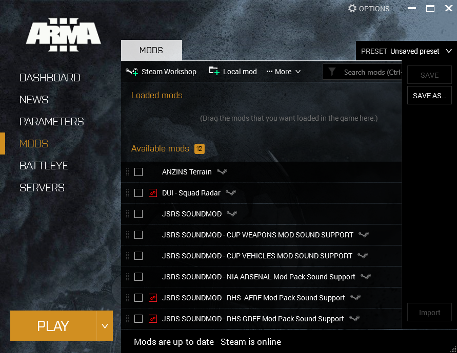
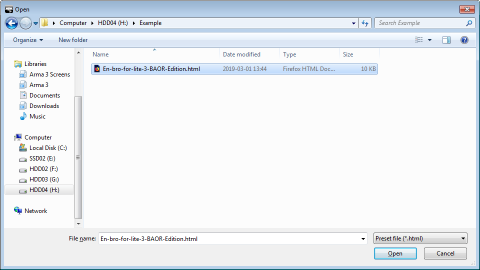

# Steam Workshop

## Vad

Arma 3-launchern låter dig ladda ned fördefinierade grupper av modifikationer som finns på Steams Arma 3-workshop.

Grupperna hanteras genom så kallade `launcher preset`-filer, generering av dessa filer är integerat i Anrops eventsidor.

## För vem

För den som vill ha den kortaste och enklaste vägen från att vilja delta till att vara redo att spela.

## Hur

### Steg 1

Navigera till det event du vill delta i på [Anrop.se](https://www.anrop.se) och hitta knappen märkt:  
`Ladda ner Launcher Preset`

Klicka på den, och kom ihåg var du sparar filen du blir ombedd att ladda ner.

### Steg 2

Starta Arma 3-launchern i Steam och gå till `MODS`-fliken, klicka sen på dropdown-menyn märkt `PRESET`.

Det för närvarande aktiva eventet visas till höger om `PRESET`-texten.  
Om inget event är valt står det istället `Unsaved preset`.

### Steg 3

I dropdown-menyn som dyker upp klickar du på knappen märkt `Import` längst ner.  
Navigera sedan dit du sparat filen du laddade ner i steg 1.  

Välj filen och klicka på `Open` eller motsvarande knapp.

### Steg 4

Om du inte redan prenumererar på alla modifikationer som krävs för eventet öppnas ett fönster som frågar om du vill prenumerera (subscribe) på de modifikationer som krävs och som du inte redan prenumererar på.

Om fönstret öppnas, klicka på `Subscribe` för att fortsätta.  
Launchern kommer nu att prenumerera på de modifikationer som saknas och börja ladda ner dem.

**Vänta nu tills alla nedladdningar är klara.**  

Hur lång tid det tar beror på din nedladdningshastighet, men även på vilken typ av disk du laddar ner till.  
En `Solid State Drive (SSD)` kommer att gå snabbare att ladda ner till än en `Hard Disk Drive (HDD)`, nedladdningshastighet är alltså inte allt om du inte kan skriva det till disk fort nog.

### Steg 5

Eventet är nu valt, och du är redo att klicka på den stora `PLAY`-knappen i launchern för att starta spelet.
