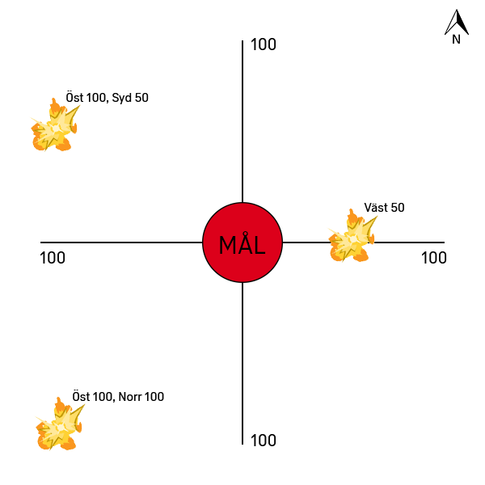

# Eldledning

## Inledning

*Detta är en översättning av den `Forward Observer Guide` som Taltsi från Arma Finland skrivit.
Den ursprungliga texten beskriver förfaranden som är optimerade för Arma.  
Den har anpassats till svenska termer, och skrivits om för att vara tydligare och mer lättläst.  
Vissa förfaranden har fått tillägg för att underlätta för eldledare och granatkastargruppchef, men grunderna är desamma.*

Eldledaren är den person som ansvarar för användandet av indirekt eld eller flygunderstöd.
Varje begäran om understöd passerar eldledaren, eller så kallar eldledaren själv in det.

## Viktigt

Innan du begär eldunderstöd se till att du har koll på följande

**Var du befinner dig**  
I relation till egna och fiendens styrkor.  
För att du snabbt och enkelt ska kunna avgöra var ett mål är i förhållande till din egen position och UPK:er.  
Om du vet hur du triangulerar din position är detta ett bra tillfälle att flexa dina skills.

**Var egna styrkor befinner sig**  
Speciellt om du inte är den som ursprungligen skickat begäran.

**Var fiendens styrkor befinner sig**  
Så exakt som möjligt, i relation till en kartmarkör - en `UPK`.  
UPK står för Utgångspunkt på kartan, i Arma representeras en UPK av en markör med tillhörande namn eller beteckning.

**Säkerställ att du och granatkastargruppen har uppfattat allt korrekt**  
När du begär att granatkastarna ska skjuta en gång, menar du 1 granat totalt eller 1 granat per granatkastare?

## Spridning

Naturlig spridning av pjäserna i en grupperad granatkastarpluton är cirka 20 meter mellan varje pjäs.  
Riktpunkt är centrumpunkten mellan pjäserna, plutonen försöker inte att sprida granaternas nedslag manuellt om det inte begärs.  
Specifierar du inte att nedslagen skall spridas över ett område kommer endast pjäsernas inexakthet spela in.

Kom ihåg att om du vill ha precis spridning av nedslag inom ett område mångdubblas tiden som krävs för att räkna ut pjäsernas inställningar.  
Du kan istället begära inexakt spridning, till exempel ±50m runt ett mål, utan att det påverkar tiden som krävs nämnvärt.  

## Signalering

Fyra olika kommandon används:

1. För att *registrera* ett mål
2. För att *rikta* pjäserna mot ett mål
3. För att *skjuta* på ett mål
4. För att *reglera* elden mot ett mål efter föregående skjutning

### Registrera ett mål

1. **Registrera!**
2. **Mål**
3. **Målnamn**

**Registrera**  
`Registrera!` - talar om för granatkastargruppchefen att han ska räkna ut pjäsinställningar för det givna målet och spara dem för framtida bruk.

**Mål**  
Det mål du vill träffa, i förhållande till en UPK.

**Målnamn**  
Beteckning på målet, så att du och granatkastargruppchefen snabbt vet exakt vilket mål det handlar om.

#### Exempel

Målet är 100m nordöst om UPK `D3` och ska betecknas `M1001`, granatkastargruppchefen räknar ut och sparar pjäsinställningarna.

| Avsändare | Meddelande |
| --- | --- |
| Eldledaren | Adam Johan från Erik Kalle, Registrera, D3 Öst 100, Norr 100, M1001. Kom |
| Grk | Adam Johan, Registrera, D3 Öst 100, Norr 100, M1001. Kom |
| Eldledaren | Korrekt. Klart slut |

### Rikta mot ett mål

1. **Rikta!**
2. **Mål**

**Rikta**  
`Rikta!` - talar om för granatkastargruppchefen att han omedelbart ska rikta pjäserna mot det givna målet.

**Mål**  
Det mål du vill träffa, i förhållande till en UPK.

#### Exempel

Målet är 100m väst och 50m syd om UPK `H7`, gruppchefen beordrar pjässerviserna att ställa in sina pjäser för skjutning mot målet.

Därigenom kan eldledaren snabbt kommendera granatkastarna att skjuta mot målet.

| Avsändare | Meddelande |
| --- | --- |
| Eldledaren | Adam Johan från Erik Kalle, Rikta, H7 Väst 100, Syd 50. Kom |
| Grk | Adam Johan, Rikta, H7 Väst 100, Syd 50. Kom |
| : | : |
| Eldledaren | Adam Johan, Eldsignalering! 3 Spräng, Eld. Kom |
| Grk | Adam Johan, Eld. Kom |
| : | Därefter regleras elden som vanligt |

### Skjuta på ett mål

Generell struktur  
1. **Eldsignalering!**
2. **Mål**
3. **Antal granater och typ**
4. **Order**

**Eldsignalering**  
`Eldsignalering!`- uppmärksammar granatkastargruppchefen på att du kommer sända information om en begärd skjutning.

**Mål**  
Det mål du vill träffa, i förhållande till en UPK.  
Här kan även spridning anges, men kom ihåg att tiden till skott ökar om spridning begärs.

**Antal granater och typ**  
Antal gånger varje pjäs skall skjuta.  
Följt av vilket slags granat som pjäserna ska använda: `Spräng`, `Rök`, eller `Lys`.

- Vill du istället att ett exakt antal granater skall skjutas måste du vara tydlig med det.
- Skjuts rök måste vindens riktning tas i beaktning för bästa effekt.

**Order**  
`Eld!` - Låter granatkastargruppchefen veta att han har klartecken att skjuta så fort ordern är kvitterad och pjäserna är redo.

#### Exempel

Målet är 50m öst om UPK `F2`, granatkastargruppchefen riktar pjäserna mot målet, varefter de skjuter tre granater var på hans kommando.

| Avsändare | Meddelande |
| --- | --- |
| Eldledaren | Adam Johan från Erik Kalle, Eldsignalering! F2 Öst 50, 3 Spräng, Eld. Kom |
| *Alternativt* | *Adam Johan från Erik Kalle, Eldsignalering! M1007, 3 Spräng, Eld. Kom* |
| Grk | Adam Johan, F2 Öst 50, 3 Spräng. Kom |
| Eldledaren | Korrekt |
| : | : |
| Grk | Adam Johan, Fyr. Kom |
| : | Eldledaren eldreglerar sedan efter behov |

### Reglera elden mot ett mål

Generell struktur  
1. **Reglera!**
2. **Justering**
3. **Antal granater och typ**
4. **Order**

**Reglera**  
`Reglera!`- uppmärksammar granatkastargruppchefen på att du kommer sända information om eldreglering baserat på föregående skjutning.

**Justering**  
Hur du vill flytta nedslagen för att få träff, i förhållande till föregående nedslag.  
Här är det viktigt att du anger var du **vill** att granaterna ska träffa, inte var de slog ner.

**Antal granater och typ**  
Antal gånger pjäserna skall skjuta och granattyp, samma som vid skjutning.

**Order**  
`Eld!` - Låter granatkastargruppchefen veta att han har klartecken att skjuta så fort ordern är kvitterad och pjäserna är redo.

#### Exempel

Nedslagen är 50m söder och 100m väster om målet, elden regleras för att träffa rätt.

| Avsändare | Meddelande |
| --- | --- |
| Eldledaren | Adam Johan från Erik Kalle, Reglera! Öst 100, Norr 50, 3 Spräng, Eld. Kom |
| Grk | Adam Johan, Öst 100, Norr 50, 3 Spräng. Kom |
| Eldledaren | Korrekt |
| : | : |
| Grk | Adam Johan, Fyr. Kom |
| : | Fortsätt därefter reglera elden efter behov |

