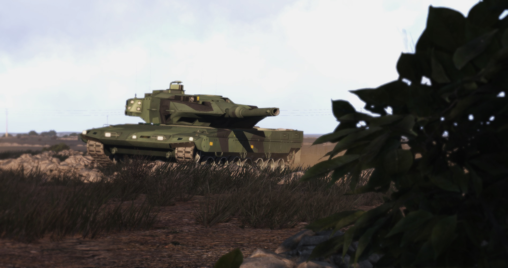

# Sverige

## Vapen

### Ak 4

[SoldF](https://www.soldf.com/automatkarbin-4-ak4/)
[Wikipedia](https://sv.wikipedia.org/wiki/Automatkarbin_4)

### Ak 5

[SoldF](https://www.soldf.com/automatkarbin-5c-ak5c/)
[Wikipedia](https://sv.wikipedia.org/wiki/Automatkarbin_5)

### Ksp 58

[SoldF](https://www.soldf.com/kulspruta-58-ksp58/)
[Wikipedia](https://sv.wikipedia.org/wiki/Kulspruta_58)

### Ksp 90

[SoldF](https://www.soldf.com/kulspruta-90-ksp-90/)
[Wikipedia](https://sv.wikipedia.org/wiki/FN_Minimi)

### Ag 90

[SoldF](https://www.soldf.com/automatgevar-90-ag90/)
[Wikipedia](https://sv.wikipedia.org/wiki/Barrett_M82)

### Psg 90

[SoldF](https://www.soldf.com/prickskyttegevar-90-90b-psg90/)
[Wikipedia](https://sv.wikipedia.org/wiki/Prickskyttegev%C3%A4r_90)

### Pistol 88

[SoldF](https://www.soldf.com/pistol-88-pist-88/)
[Wikipedia](https://sv.wikipedia.org/wiki/Glock_17)

### Grg m48 / m86

[SoldF](https://www.soldf.com/granatgevar-84-cm-carl-gustaf-m48-m86/)
[Wikipedia](https://sv.wikipedia.org/wiki/Granatgev%C3%A4r_m/48)

### Pskott 86

[SoldF](https://www.soldf.com/pansarskott-86-pskott86/)
[Wikipedia](https://sv.wikipedia.org/wiki/Pansarskott_m/86)

## Uniformer & Kamoflague

### M59

### M90

### M90K

## Terrängbilar

### Tgb 11

[SoldF](https://www.soldf.com/fordon/terrangbil-11-13-tgb-11-tgb-13/)

### Tgb 16

[Wikipedia](https://sv.wikipedia.org/wiki/BAE_Systems_OMC_RG32M)

### Patgb 360

[SoldF](https://www.soldf.com/fordon/pansarterrangbil-360-patgb360/)

## Bandvagnar

### Bandvagn 206

[Wikipedia](https://sv.wikipedia.org/wiki/Bandvagn_206)

## Stridsfordon

### Strf 90

[Wikipedia](https://sv.wikipedia.org/wiki/Stridsfordon_90)

## Stridsvagnar

### Strv 122

[SoldF](https://www.soldf.com/fordon/stridsvagn-122-strv-122/)
[Wikipedia](https://sv.wikipedia.org/wiki/Stridsvagn_122)

## Helikoptrar

### Hkp 9

### Hkp 16

[SoldF](https://www.soldf.com/flyg/helikopter-16-hkp-16/)

## Flygplan

### JAS 39 Gripen

[SoldF](https://www.soldf.com/flyg/jas-39-gripen/)

### Tp 84

[SoldF](https://www.soldf.com/flyg/transportplan-84-tp84/)