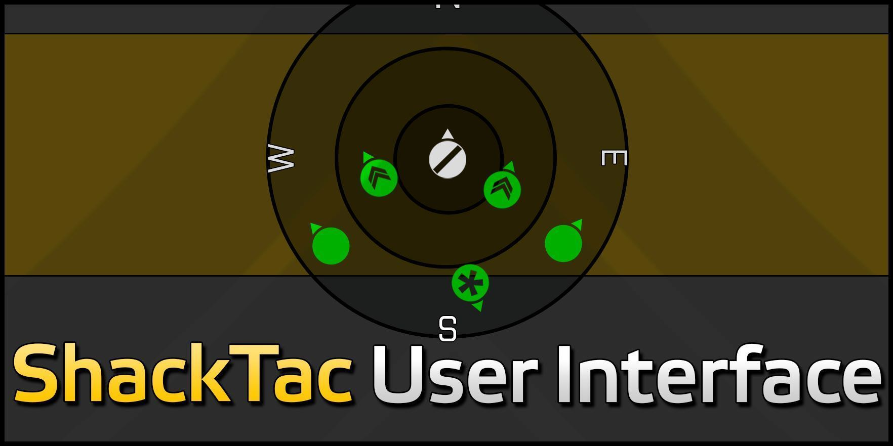

# Client Side

Följande moddar behöver bara köras av spelaren och inte av servern.
De är tillåtna på Anrop event men inte nödvändigtvis på externa.

## JSRS

JSRS förbättrar markant ljudeffekterna i spelet jämfört med standardljuden.

För många modifikationer behövs en extra modul för att ljuden ska bytas ut.

### RHS

För RHS behöver du motsvarande JSRS modul för att ändra alla vapenljud

* [JSRS RHS AFRF](https://steamcommunity.com/sharedfiles/filedetails/?id=945476727)
* [JSRS RHS GREF](http://steamcommunity.com/sharedfiles/filedetails/?id=1180534892)
* [JSRS RHS SAF](http://steamcommunity.com/sharedfiles/filedetails/?id=1486541773)
* [JSRS RHS USAF](https://steamcommunity.com/sharedfiles/filedetails/?id=1180533757)

### NIArms

[JSRS NIArms Arsenal](http://steamcommunity.com/sharedfiles/filedetails/?id=1180543457)

### SFP

[SFP JSRS](https://steamcommunity.com/sharedfiles/filedetails/?id=1205570929)

För FFP behövs även [FFP JSRS](https://steamcommunity.com/sharedfiles/filedetails/?id=1220451406)

### SMA

[JSRS SMA](http://steamcommunity.com/sharedfiles/filedetails/?id=1196700252)

## ShackTac User Interface

[ShackTac User Interface](https://steamcommunity.com/sharedfiles/filedetails/?id=498740884) läggs till en radar som visar medlemmar i din grupp nära dig.
