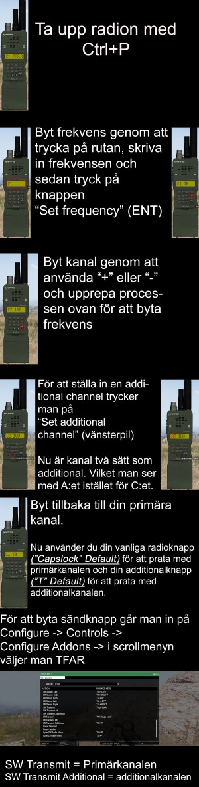

# TFAR (Task Force Radio)

## Installation

För att installera TFAR stänger du av Teamspeak och dubbelklickar på ts3plugin filen i TFAR mappen

## Användande

### Keybinds

#### För skyttesluskar

Knapp | Förklaring
--- | ---
Voice activated eller PTT | Prata med personer nära dig utan radio
Caps Lock | Sänd på din radio
CTRL + P | Öppna din radios inställningar
CTRL + [←,↑,→] | Byt mellan vänster/båda/höger öra för din radio
NUMPAD 1-8 | Byt kanal på din radio
CTRL + TAB | Ändra volym för samtal med personer nära dig
ESC | Stäng radioinställningar

#### För gruppchefer

Knapp | Förklaring
--- | ---
CTRL + Caps Lock | Sänd på radio med lång räckvidd
ALT + P | Öppna inställningar för radio med lång räckvidd
ALT + [←,↑,→] | Byt mellan vänster/båda/höger öra på radio med lång räckvidd
CTRL + NUMPAD [1-9] | Byt kanal på radio med lång räckvidd
T | Sänd på "Additional Channel" på radio, se nedan
Y | Sänd på "Additional Channel" på radio med lång räckvidd, se nedan
ESC | Stäng radioinställningar

### Additional Channel

TFAR möjliggör på radioapparater att lyssna och sända på mer än en kanal.
För att välja din "Additional Channel" byter du till en ledig kanal på din radio, väljer frekvens och trycker på "Set Additional Channel" knappen.
Därefter byter du tillbaka till din vanliga kanal.

## Radiosystem

### Blufor

#### RF-7800S-TR

#### AN/PRC-152

#### RT-1523G
