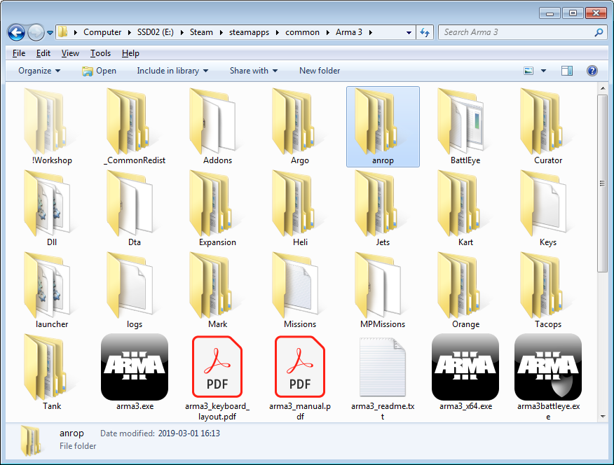
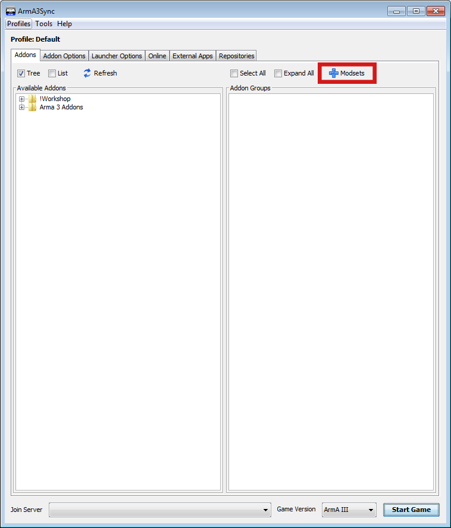
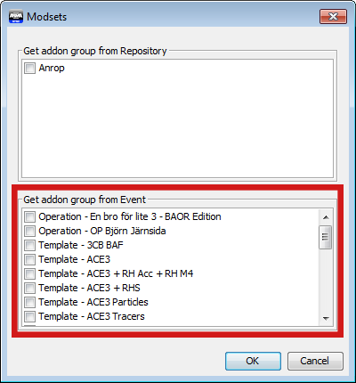

# Arma3Sync

## What

Arma3Sync is a powerful third-party launcher for Arma 3.
It supports the use of groups of mods - `modsets` - modsets can be defined by individual users or an event host, and they can be loaded independently of each other.

Arma3Sync also simplifies downloading mods from many different sources - known as `repositories`.

Anrop's Arma3Sync repository is integrated with the operation pages on Anrop.se.  
This enables users to browse either the full repository containing all mods currently being hosted in the repository, or event-specific subrepositories containing only mods that are part of a specific operation's modset.

## For Whom

For users who want better control of when mods are downloaded or updated, and where they are downloaded to and loaded into the game from.

A number of additional options are available, but do not differ much from the basic Arma 3 launcher for normal users.

## Installation

### Step 1

[Download Arma3Sync by clicking this link.](http://hosted.anrop.se/arma3sync.exe) run the installer and then start Arma3Sync when the installer finishes.

You will then be presented with the following screen, asking you for the path to your Arma 3 installation folder.

Find your Steam installation folder, from there the path to the Arma 3 folder is:  
`\Steam\steamapps\common\Arma 3\`


### Step 2

Before doing anything else we need to decide to where the mods shall be downloaded.

In Windows Explorer navigate to your Arma 3 installation folder.  
Create a folder called `anrop` there.   
This will be where we the mods are downloaded to.

**Do not touch any other folder or file in the Arma 3 directory!**



### Step 3

Open Arma3Sync and go to the tab `Addon Options`.

Click the blue plus sign on the right hand side.  
Navigate to the folder you just created, select it, and press open in the menu that popped up.


Now we have a place to download mods to, on to figuring out what mods to download!

## Connecting to Anrop's Repository

### Step 1

Now go to the tab `Repositories` and click the blue plus present on the right side there.

In the window that pops up paste the adress below into the field `Public auto-config url` and press the `Import`-button:  
```https://arma3sync.anrop.se/.a3s/autoconfig```


This sets up a bookmark for Anrop's repository, now you're ready to grab some modsets!

## Adding a modset

### Step 1

Switch to the `Addons` tab.

On the left under `Available Addons` mods that are present in the `anrop` folder are shown.  
On the right under `Addon Groups` groups of addons - commonly referred to as `modsets` - are listed.

To retrieve the modset of an event, click the blue plus labelled `Modsets` above the `Addon Groups` section.



In the window that pops up, under `Get addon group from Event` select the operation or template you want to add.  
Click `OK` to add the selected modset(s) to your local addon groups.



### Step 2

The modset you selected should now appear in the `Addon Groups` section.  
In order for it to be loaded when you start the game you need to check the checkbox to the left of the folder icon of the modset.

Check the checkbox, then click the plus to the left of the checkbox to expand the modset.  
Now you will see that the mods are listed with red instead of black text, indicating that they are not present in your `anrop` folder.

To fix this we will have to download the mods, more about that below.


## Downloading Mods

### Step 1

In the `Repositories` tab, look at the list of events and find the operation that you will be participating in next.

Select it by clicking on it, then click the button with the blue arrow to the right of the list in order to connect to that operation's repository.


### Step 2

Now you have the mods required for that event in front of you.  
All mods that you have not downloaded already will have a Warning sign instead of the normal icon, as well as red text, together signifying that they are not downloaded yet.

In order to download mods you select each of the mods that you want to download.  
You do this by either checking the box to the left of the mod's icon, or by clicking `Select All` in the menu above the list.

**Do note that you should under NO circumstances connect to the main repository and click Select All, as you will be downloading several hundred Gigabytes of mods then!**

Now click the `Start`-button on the left to download the selected mods.


### Step 3

When the download is done you are ready to take part in a operation!  
Check the `Addons` tab once more to make sure that you have selected the correct modset to start with, and then press `Start Game`.

