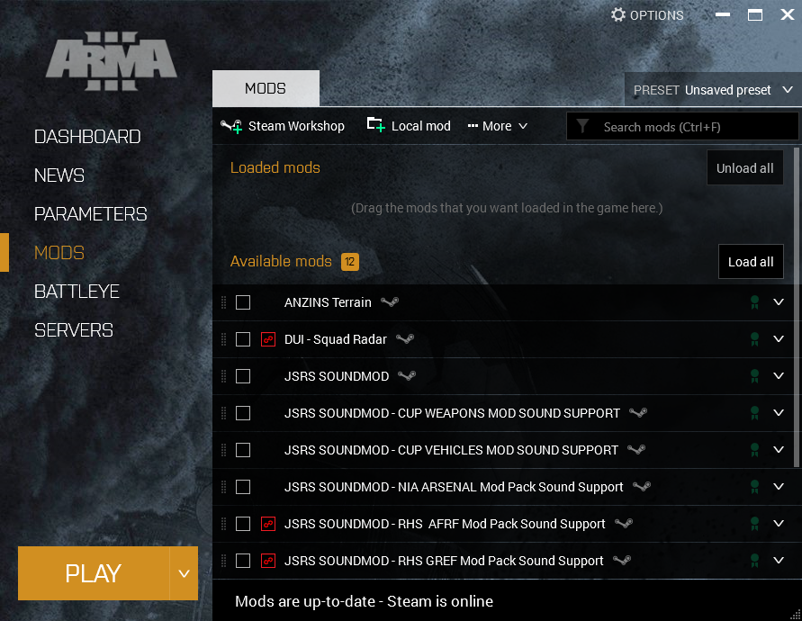
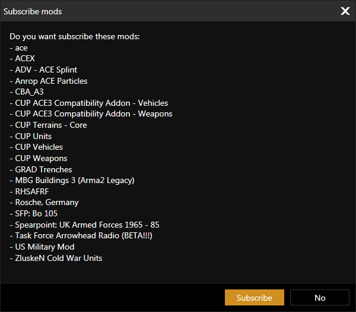

# Steam Workshop

## What

The Arma 3 launcher supports loading predefined sets of mods - launcher preset files - available on the Arma 3 Steam Workshop.

Generation of launcher preset files is integrated into Anrop's event pages.

## For Whom

For those who want the shortest and simplest path from deciding to attend an event to being able to play.

## How

### Step 1

Navigate to the relevant event page on [Anrop.se](https://www.anrop.se) and find the button labelled:  
`Ladda ner Launcher Preset`

Click it, and remember where you saved the preset file that you are asked to download.

### Step 2

Start the Arma 3 launcher in Steam and go to the `MODS` tab, then click the dropdown menu labelled `PRESET`.

The currently active preset is shown to the right of the `PRESET` label.  
If no preset is selected, `Unsaved preset` is displayed instead.

### Step 3

In the dropdown menu that appears, click `Import` at the bottom, and navigate to where you saved the file in the first step.  

Select the file and press `Open`.

### Step 4

Now a popup appears asking you if you would like to subscribe to the mods that are part of the preset and you have not already subscribed to.

In case the popup appears, click on `Subscribe` to continue, the launcher will now subscribe you to the mods in the Steam Workshop, and start downloading.

Wait until it is done, how long it takes depends on your download speed and what type of disk you are downloading to.  
A Solid State Drive (SSD) is faster than a Hard Disk Drive (HDD), meaning that it may take time even if you have a fast internet connection.

### Step 5

The mods are now selected, and you are ready to press the large `PLAY`-button in the launcher to start the game.
